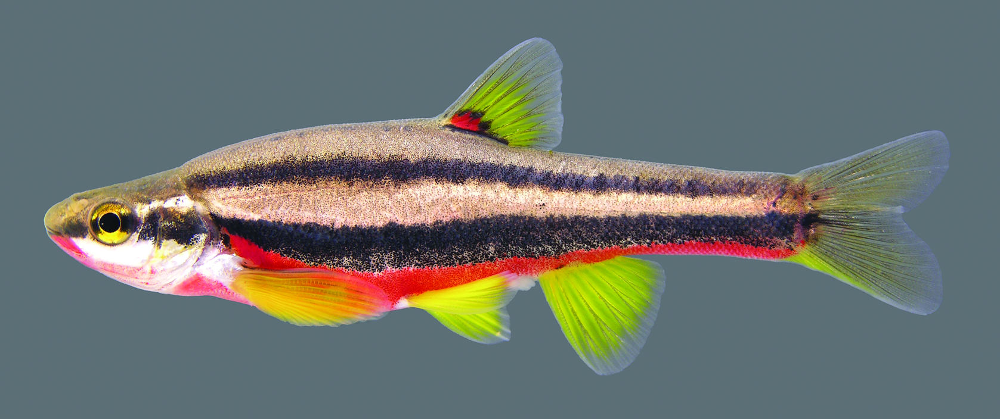
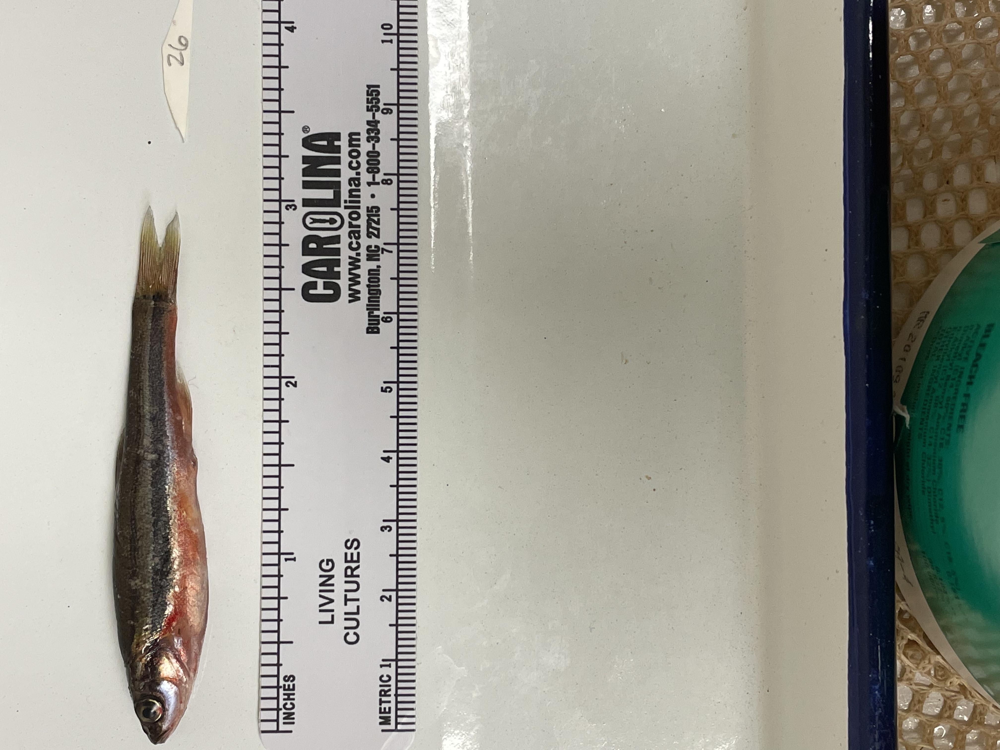

```{r setup, include=FALSE}
knitr::opts_chunk$set(echo = TRUE)
```

```{r libraries}
library(tidyverse) #importing, tidying, plotting data
library(knitr) #making tables
library(leaflet)
library(tinytex) #may need for knitting pdf versions of .rmd file
library(ggplot2)
library(data.table)
library(ggfortify)
```


## R Markdown

This is an R Markdown document. Markdown is a simple formatting syntax for authoring HTML, PDF, and MS Word documents. For more details on using R Markdown see <http://rmarkdown.rstudio.com>.


```{r import Sex_Sat}
library(readr)
Sex_Sat <- read_csv("data/Sex_Sat.csv")
```
<span style="color:blue">First, lets make a simple graph using some base R code.</span>

```{r Scatter Sex_Sat}
ggplot(Sex_Sat, aes(x = Sex, y = AverageSat, shape = Sex, color = Sex)) +
	geom_point(size = 5) +
	xlab("Sex") +
	ylab("Band Saturation") +
theme(
	axis.title.x = element_text(colour = "cornflowerblue", size =rel(2)),
	axis.text.x = element_text(angle = 0, size = 13, vjust = 0.5)) +
  theme(
	axis.title.y = element_text(colour = "purple", size =rel(2)),
	axis.text.y = element_text(angle = 0, size = 13, vjust = 0.5))

ggsave("outputs/Sex_Sat.png")
  
```
#Body condition factor is CF = ((body weight(g) - gut content(g)) / length(cm)3) *100.

```{r Binomial}
Site <- read.delim("data/Site_BodyConditionFactor.csv")
ggplot(Site_BodyConditionFactor,aes(Body_Condition_Factor,Site_Location)) +
  geom_point() +
  geom_smooth() +
  xlab ("Body Condition Factor") +
  ylab ("Site") +
  labs(title="Raw Fit: 1=Wall Branch, 0=Dry Fork")
```

```{r rescale binary data}
Site_BodyConditionFactor$Body_Condition_Factor100 <- Site_BodyConditionFactor$Body_Condition_Factor/100
fit.1 <- glm(Site_Location~Body_Condition_Factor100, data=Site_BodyConditionFactor, binomial(link="logit"))
autoplot(fit.1)
```

```{r binnedplot}
library(arm)
x <- predict(fit.1)
y <- resid(fit.1)
binnedplot(x, y)
```
```{r coeff}
coef(fit.1)
```
```{r coefint}
confint(fit.1)
```
```{r Binary_Data_Site_BCF}
ggplot(Site_BodyConditionFactor, aes(Body_Condition_Factor,Site_Location)) +
  geom_point() +
  geom_smooth(method="glm", method.args=list(family="binomial"(link="logit"))) + 
  xlab ("Body Condition Factor") +
  ylab ("Site")
```

```{r import GSI_Area}
library(readr)
GSI_RedColoration_Area <- read_csv("data/GSI_RedColorationArea.csv")
```

```{r scatter plot GSI_RedColorationArea}
ggplot(data = GSI_RedColorationArea, aes(x=GSI_Value, y=Red_Coloration_Area)) +
geom_point()+
  xlab("GSI") +
	ylab("Red Coloration %") +
theme_bw()+
geom_smooth(method=lm)


ggsave("outputs/ScatterGSI_Area.png")
```


```{r Fit lm GSI_Area}

FitGSI_Area <- lm(data= GSI_RedColorationArea, Red_Coloration_Area~GSI_Value)
summary(FitGSI_Area)

```
```{r autoplotlm}
autoplot(FitGSI_Area)
```
```{r boxcox}
boxcox(FitGSI_Area)
```

#GLMs have three components:
#a linear predictor
#a variance function
#a link function.

```{r GLM}
GLM_GSI_Area <- glm(Red_Coloration_Area~GSI_Value, data= GSI_RedColorationArea, family= gaussian(link=)) 
```


```{r ANOVA}
anova(GLM_GSI_Area)


```
```{r GLM Output} 
GSI_Area_Gamma <- glm(Red_Coloration_Area~GSI_Value, data= GSI_RedColorationArea, family=Gamma(link= )) 
```

```{r summary}
summary(GSI_Area_Gamma)
```

```{r glm}
ggplot(GSI_RedColorationArea,aes(GSI_Value,Red_Coloration_Area)) +
  geom_point() + 
  geom_smooth(method=,colour=, method.args=list(family=link=\sqrt))+ 
  labs(title=GLM, square-root, Gamma Variance)
                                                                                                                                            
```

```{r SRBD Site Map}
leaflet() %>%
  setView(-86.854396, 36.26361 , zoom = 16) %>% #lat-long of the place of interest
  addTiles() %>%
  addProviderTiles('Esri.WorldImagery') %>%
  addMarkers(-86.854396, 36.26361 , popup = "Dry Fork, Whites Creek System")
```


```{r SRBD Site Map2}
leaflet() %>%
  setView(-87.287965, 36.499277 , zoom = 16) %>% #lat-long of the place of interest
  addTiles() %>%
  addProviderTiles('Esri.WorldImagery') %>%
  addMarkers(-87.287965, 36.499277 , popup = "Rotary Park, Wall Branch Creek System")
```

```{r image}

```

```{r image}

```

```{r image}

```